#Jfinal 的swagger插件

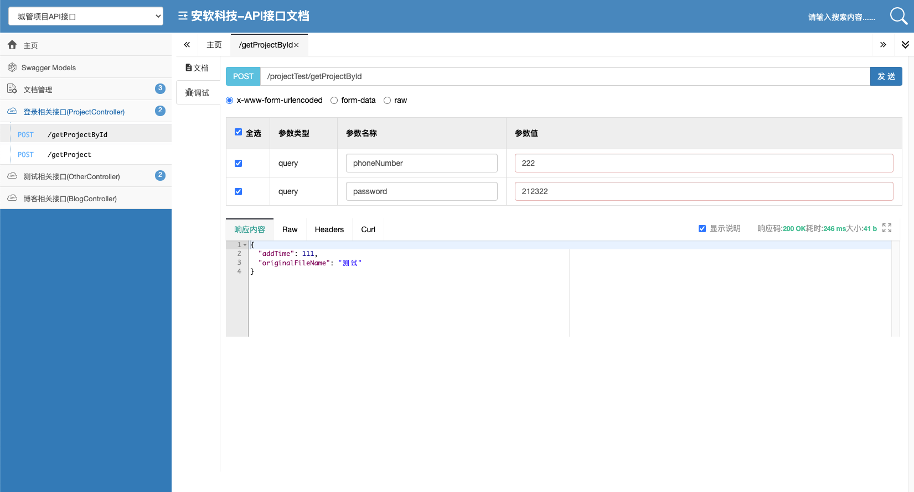
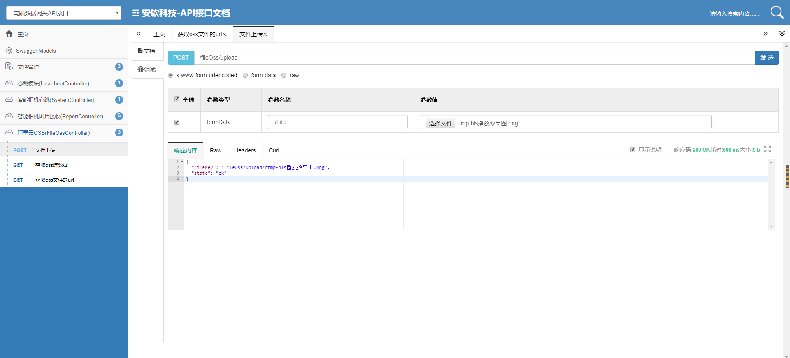
Jfinal-Swagger-Plug 配置以及注解说明(更新上传文件)

 Author :Junior Ray  2020/7/16 
 
###一.使用示例：

1.配置maven仓库和引入公司开发好的：jfinal-swagger-junior-1.0.0.jar 

```maven
<!-- 配置 maven库 -->
<repositories>
   <repository>
      <id>ali-maven</id>
      <url>http://maven.aliyun.com/nexus/content/groups/public</url>
      <releases>
         <enabled>true</enabled>
      </releases>
      <snapshots>
         <enabled>true</enabled>
         <updatePolicy>always</updatePolicy>
         <checksumPolicy>fail</checksumPolicy>
      </snapshots>
   </repository>
   <repository>
      <id>softsz-maven</id>
      <url>http://maven.data-iot.cn:8081/repository/softsz/</url>
      <releases>
         <enabled>true</enabled>
      </releases>
      <snapshots>
         <enabled>true</enabled>
         <updatePolicy>always</updatePolicy>
         <checksumPolicy>fail</checksumPolicy>
      </snapshots>
   </repository>
</repositories>
```

然后引入maven：
```maven
<!--jfinal-swagger-->
<!--jfinal-swagger-->
<dependency>
    <groupId>cn.junior</groupId>
    <artifactId>jfinal-swagger-junior</artifactId>
    <version>1.1</version>
    <exclusions>
        <exclusion>
              <groupId>com.jfinal</groupId>
              <artifactId>jfinal</artifactId>
        </exclusion>
    </exclusions>
</dependency>
```
ps:如果maven仓库因迁移至内网失效，请自己行用maven打包成jar

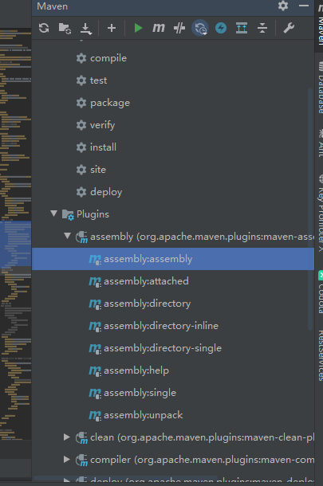

然后项目中单独引入该jar即可

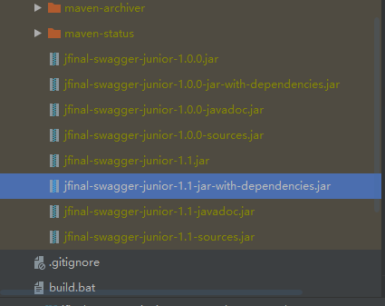


2.在JfinalConfig类中配置路由 
```java
/**配置路由*/
public void configRoute(Routes me) {

/**集成swagger author:JuniorRay**/
me.add(new JuniorSwaggerRoutes());

/**要被swagger识别需要在Route的配置中将需要识别的controller按照下面的格式配置（项目中所有的路由必须用new Routes()不能写在外面!!!,否则会识别不到路由！！！切记！！！）：**/
me.add(new ProjectRoutes());//项目中的路由，全部包在new Routes()里面

}
```


3.配置Jfinal中的Handler处理器
```java
/**配置处理器*/
public void configHandler(Handlers me) {
/**集成swagger接管所有web请求，并对应用拥有完全的控制权 author:JuniorRay**/
me.add(new JuniorSwaggerHandler());
}
```

4.配置Jfinal中的configPlug 
```java
/**
* 配置插件
*/

public void configPlugin(Plugins me) {
/**集成swagger
* author:JuniorRay
* **/

/**Boolean.TRUE 是否启用swagger*/
me.add(new JuniorSwaggerPlugin(Boolean.TRUE)
/**第一个参数是服务ip，第二个是swagger要扫描的包名，第三个是分组名称**/
.addSwaggerDoc(new SwaggerDoc("127.0.0.1","com.demo","城管项目API接口"))
/**可以配置多个分组名称，可以在swagger首页页面下拉框中切换分组名称到不同的分组API*/
.addSwaggerDoc(new SwaggerDoc("127.0.0.1","com.demo","城管项目Kafka接口") )
);
}
```
5.配置前后端分离的页面层传入层VO，以及数据传输层DTO 

5.1 PhotoVo:
```java
package com.demo.dto;

import cn.junior.swagger.annotation.ApiModel;
import cn.junior.swagger.annotation.ApiParam;

import lombok.Data;
import lombok.extern.slf4j.Slf4j;

/**
* @Title: PhotoVo
* @Description:
* @Author: Junior Ray
* @Date: 2020-07-15 18:44
* @Version: 1.0
* @Copyright: Copyright (c) 2020 SoftSz All rights reserved
**/
@ApiModel(description = "图片上传成功后返回的信息")
@Slf4j
@Data
public class PhotoVo {
@ApiParam(description = "图片id")
private Integer id;
@ApiParam(description = "图片MD5值")
private Integer md5;
@ApiParam(description = "图片地址")
private Integer url;
@ApiParam(description = "图片原文件名")
private String originalFileName;
@ApiParam(description = "图片类型")
private String fileType;
@ApiParam(description = "图片宽度")
private Integer width;
@ApiParam(description = "图片高度")
private Integer height;
}
```


5.2 PhotoDto:
```java
package com.demo.dto;

import cn.junior.swagger.annotation.ApiModel;
import cn.junior.swagger.annotation.ApiParam;

import lombok.Data;
import lombok.extern.slf4j.Slf4j;


@ApiModel(description = "图片上传成功后返回的信息")
@Slf4j
@Data
public class PhotoDto {
@ApiParam(description = "图片id")
private Integer id;
@ApiParam(description = "图片MD5值")
private Integer md5;
@ApiParam(description = "图片地址")
private Integer url;
@ApiParam(description = "图片原文件名")
private String originalFileName;
@ApiParam(description = "图片类型")
private String fileType;
@ApiParam(description = "图片宽度")
private Integer width;
@ApiParam(description = "图片高度")
private Integer height;
@ApiParam(description = "图片上传时间")
private Integer addTime;

}
```


6.配置Controller以及注解

目录结构：

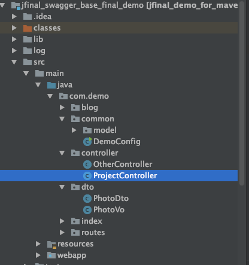

注解配置：

```java
package com.demo.controller;

import cn.junior.swagger.annotation.*;
import cn.junior.swagger.config.RequestMethod;
import com.alibaba.fastjson.JSON;
import com.demo.dto.PhotoDto;
import com.demo.dto.PhotoVo;
import com.jfinal.core.Controller;

@Api(description = "登录相关接口")
public class ProjectController extends Controller {
//具体参数传参
@ApiOperation(description="获取项目id接口", value="/getProjectById",
            summary = "获取项目", methods = RequestMethod.GET)
@ApiParams({
@ApiParam(required = true, name = "phoneNumber", description = "用户手机号",dataType="string" ,defaultValue = "222"),
@ApiParam(required = true, name = "password", description = "密码",dataType="string" ,defaultValue = "212322")
})
@ApiResponses({
@ApiResponse(response = PhotoDto.class)
})
public void getProjectById(){
PhotoDto photoDto = new PhotoDto();
photoDto.setAddTime(111);
photoDto.setOriginalFileName("测试");

String json = JSON.toJSONString(photoDto);
renderJson(json);
}

//上传文件示范
@ApiOperation(
      description = "文件上传接口",value="/fileOss/upload",
      summary = "文件上传", methods = RequestMethod.POST
)
@ApiParams({
      @ApiParam(required = true, name = "uFile", description = "上传的文件",    dataType= DataType.File)
})
@ApiResponses({
      @ApiResponse(response = Ret.class)
})
public void upload() throws Exception {
      UploadFile uFile = getFile("uFile");

      if(uFile == null){
         renderJson( Ret.fail(Const.MSG,"文件为空"));
         return;
      }
      File file = uFile.getFile();
      String filename = uFile.getOriginalFileName();
      String fileKey = ossUtil.uploadObjectByInputStream(new FileInputStream(file),filename);
      renderJson(Ret.ok("fileKey",fileKey));
}


//以model对象进行传参
@ApiOperation(description = "获取项目接口", value="/getProject",
            summary = "获取项目",  methods = RequestMethod.POST)
@ApiRequests(request = PhotoVo.class)
@ApiResponses({
@ApiResponse(response = PhotoDto.class)
})
public void getProject(){
PhotoDto photoDto = new PhotoDto();
photoDto.setAddTime(111);
photoDto.setOriginalFileName("测试model传参");
String json = JSON.toJSONString(photoDto);
renderJson(json);
}
}
```
###注意事项：
~~~
Swagger 中 @ApiParam的 paramType（默认值query）的值包括如下5项：
    header-->请求参数的获取：@RequestHeader()
    query-->请求参数的获取：@RequestParam() 
    path-->请求参数的获取：@PathVariable()
    body-->请求参数的获取：@RequestBody()
    form（不常用）
~~~
1.关于@ApiResponses 注解 如果有返回值一定要设置DTO。这样swagger才能识别到返回的数据格式到doc文档，如果无返回可以省略此注解

2.@Slf4j和@Data 是 lombok的注解，需要idea配置lombok插件，具体插件配置需要请查看：https://www.cnblogs.com/pcheng/p/10945476.html

###二.最终效果(浏览器输入http://localhost/doc.html）

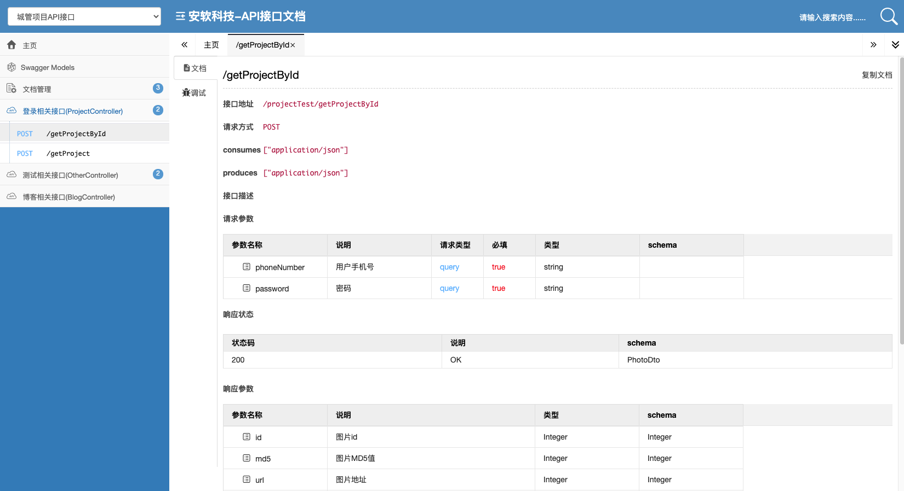


#注意事项


1.当swagger页面不出现接口模型时，请检查这三个位置是否都配置正确：

①检测填写的扫描包名路径是否正确

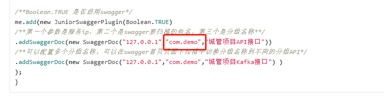

②检测路由是由在new Route()里面


里面.png)


③检测controller类名是否有加@Api


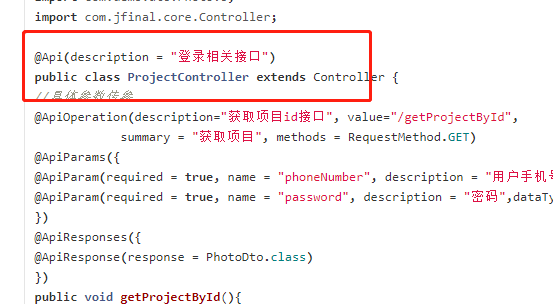


2.jfinal-swagger-junior 更新到1.1版本说明，如果swagger页面遇到无法上传文件，没有上传文件按钮，请更新到pom版本到1.1


```maven

<!--jfinal-swagger-->
<dependency>
    <groupId>cn.junior</groupId>
    <artifactId>jfinal-swagger-junior</artifactId>
    <version>1.1</version>
    <exclusions>
        <exclusion>
              <groupId>com.jfinal</groupId>
              <artifactId>jfinal</artifactId>
        </exclusion>
    </exclusions>
</dependency>

```


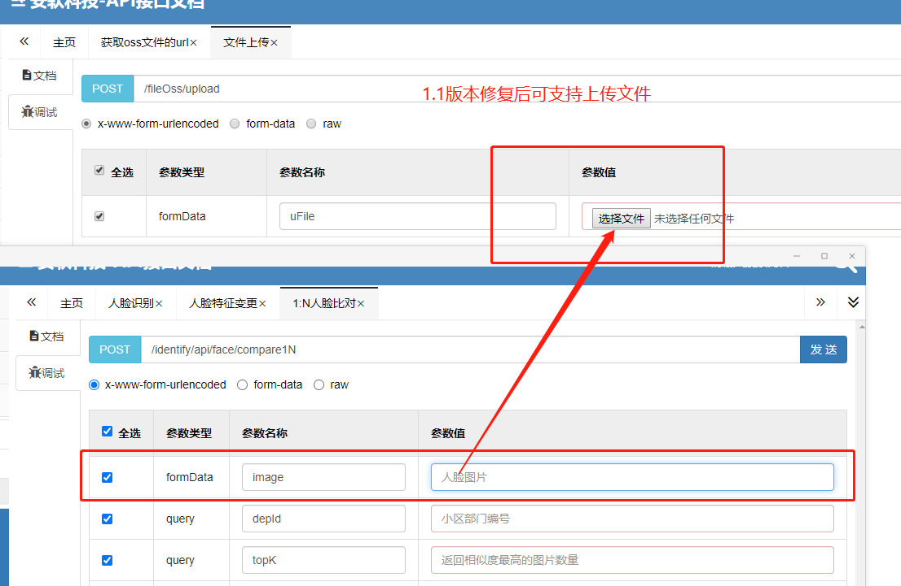


3.undertow容器报错 (current frame, stack[1]) is not assignable to 'com/jfinal/handler/Handler'解决方案

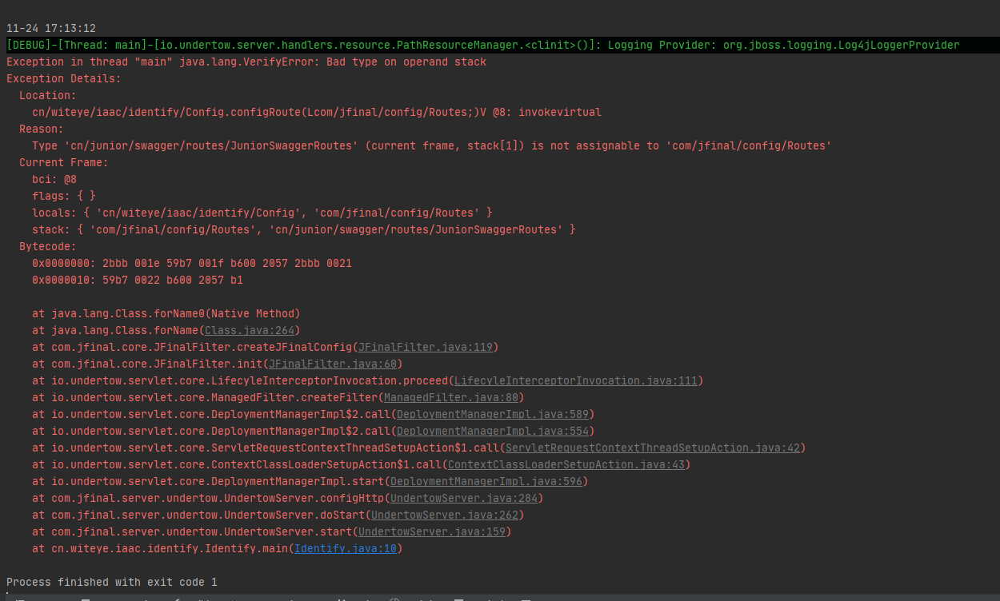

在undertow启动的时候添加外部类即可

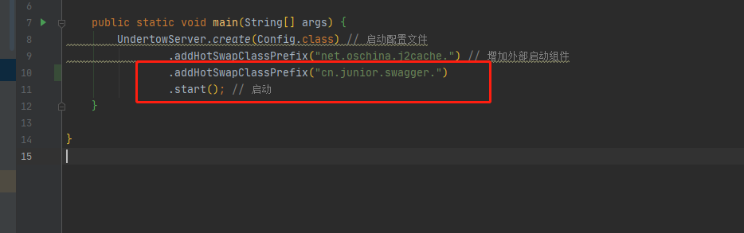


